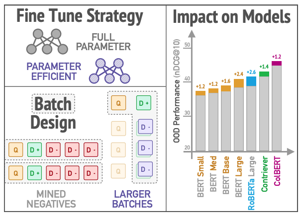

# A Simple Recipe for Improving Out-of-Domain Retrieval in Dense Encoders

This repository contains the code for [A Simple Recipe for Improving Out-of-Domain Retrieval in Dense Encoders](https://arxiv.org/abs/2311.09765)



We recommend a simple recipe for training dense encoders to improve out-of-domain performance:
1. Train with parameter-efficient methods such as LoRA rather than full-finetuning
2. opt for using in-batch negatives unless given well-constructed hard negatives.

We conducted a series of carefully designed experiments over the recipes and could see that our findings hold for various cases such as adopting larger base models, different retriever architectures (e.g., late interaction models), and additional contrastive pretraining of the base model (e.g., pre-trained Contriever)

## Requirements
```
pip install -r requirements.txt
```

## Datasets
### Train Dataset
* [MSMARCO](https://microsoft.github.io/msmarco/)
* [NQ](https://github.com/facebookresearch/DPR)
### Test Dataset
* [Beir](https://github.com/beir-cellar/beir)

### Negative Sampling
* [MSMARCO](https://microsoft.github.io/msmarco/)
* Random
* BM25
* self-distillation
* self-distillation with denoising step
* [RocketQA](https://github.com/PaddlePaddle/RocketQA)

## Train / Inference

We categorize the files based on the dense retriever architectures used in our experiments: **asymmetric**, **symmetric**, and **late interaction**. We base our codebase from each representative repos as we follow the architectural design from each model. 

- **asymmetric architectures**: [DPR](https://github.com/facebookresearch/DPR).  
- **symmetric architectures**: [Contriever](https://github.com/facebookresearch/contriever).  
- **late interaction models**: [ColBERT](https://github.com/stanford-futuredata/ColBERT).  

Detailed instructions for running the models can be found in the README file within each respective folder.  

For details on how to run the models, please look at the README under each folder:

* [Asymmetric](https://github.com/amy-hyunji/simple-recipe-to-improve-OOD/blob/main/asymmetric/README.md)
* [Symmetric](https://github.com/amy-hyunji/simple-recipe-to-improve-OOD/blob/main/symmetric/README.md)
* [Late-Interaction](https://github.com/amy-hyunji/simple-recipe-to-improve-OOD/blob/main/late-interaction/README.md)

### Contact
Please leave Github issues or contact Hyunji Lee `hyunji.amy.lee@kaist.ac.kr` for any questions

### Citation
```
@article{hyunji-lee-lora-retrieval-2023,
  title={Back to Basics: A Simple Recipe for Improving Out-of-Domain Retrieval in Dense Encoders},
  author={Lee, Hyunji and Soldaini, Luca Soldaini and Cohan, Arman and Seo, Minjoon and Lo, Kyle},
  journal={ArXiv},
  year={2023}
}
```
